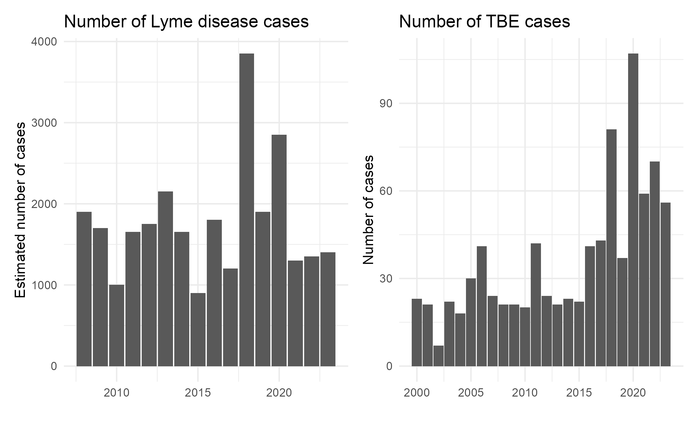

<style>
body {
  text-align: justify;
  }
.html-widget {
  margin: auto;
  margin-bottom: 20px;
  margin-top: 20px;
}
</style>

```{r setup, include=FALSE}
knitr::opts_chunk$set(echo = FALSE, warning = FALSE, message = FALSE, fig.align = "center")
```

```{r}
# loading necessary packages
library(shiny)
library(leaflet)
library(sf)

# loading necessary data for the leaflet maps
plateau <- st_transform(read_sf("processed_data/plateau/plateau.shp"), crs=4326)
fishnet <- st_transform(read_sf("processed_data/fishnet/fishnet.shp"), crs=4326)
validation <- st_transform(read_sf("processed_data/validation/validation.shp"), crs=4326)
tick_bites <- st_transform(read_sf("processed_data/tick_bites/tick_bites_plateau.shp"), crs=4326)

# leaflet map that acts as basis for visualizations
basemap <- leaflet(options = leafletOptions(zoomSnap = 0.1, minZoom = 7.8)) %>%
  setView(lng=7.671679, lat=46.96051, zoom = 7.8) %>%
  setMaxBounds(lng1=4.857424, lat1=46.09225, lng2=10.49224, lat2=47.81489) %>%
  addProviderTiles(providers$CartoDB.Positron,
                   options = providerTileOptions(noWrap = TRUE)
                   )
```

```{r fig.cap = "*Ixodes ricinus* [@zowiac]"}

```

# Introduction

## Background

The most common tick species in Europe, *Ixodes ricinus*, is a parasite for more than 200 distinct species [@Oechslin2017], such as reptile, avian and mammalian species, including humans, making it very generalist [@Herrmann2010]. Ticks serve as a carrier of numerous human and animal pathogens of bacterial, viral, or protozoan origin [@FOPH2023b; @Oechslin2017]. As opposed to other carriers of viruses such as mosquitoes, ticks are unable to fly or jump. Instead, they wait in a position known as *questing*. Doing so, ticks hold onto leaves or grasses with their third and fourth pair of legs, while the first pair of legs is outstretched to climb onto potential hosts. This means that ticks can only attach onto hosts if they had direct contact with them [@Leal2020].

Among other infectious diseases, **Lyme disease** and **tick-borne encephalitis (TBE)** are the most relevant tick-transmitted diseases in Switzerland [@FOPH2023c; @Oechslin2017]. Lyme disease is caused by the bacteria Borrelia Burgdorferi, which is carried by around 5-30% of ticks, locally, even up to 50%. It is transmitted to humans and other affected species by bites of infected ticks. Depending on the species of the Borrelia bacteria and the stage of the disease, different organs can be affected. As a result of unnoticed exposure or insufficient treatment, permanent disabilities can occur [@FOPH2023a]. The @FOPH2023a estimates that up to 10’000 people are infected by Lyme disease annually in Switzerland.

```{r fig.cap = "Figure 1: Number of Lyme disease and TBE cases per year [@FOPH2023c]", out.width="75%"}

```

In addition to Lyme disease, TBE is equally caused by bites from virus-infested ticks [@FOPH2023b]. Although most of the infected people do not show any reactions, some might develop flu-like symptoms after seven to fourteen days. In 5-15% of the infections, even if no symptoms occurred after the bite, infestations of the central nervous system are possible, which can lead to permanent disabilities. In around 1% of the cases with an infestation of the central nervous system, the infection leads to death [@FOPH2023b]. According to the @FOPH2023b, the number of yearly infections varies between 100 and 250. For TBE, protection through vaccinations is possible and recommended for all cantons in Switzerland, except Ticino and Geneva [@FOPH2023b]. Through its ability to spread diseases, ticks provide an ecosystem disservice [@Dunn2010].

Several studies in Switzerland analyzed the influence of environmental conditions on the behavior of *Ixodes ricinus*. Depending on the weather, ticks are most active in the season from February or March to November [@FOPH2023c; @Herrmann2010]. They are present in deciduous forests with rich undergrowth, where the tick's distribution is limited by vegetation cover with a relative humidity of around 80%, where ticks can exist up to an altitude of 2000m a.s.l. [@FOPH2023b]. The activity of the ticks is limited to temperatures above 7°C [@Perret2000] and is reduced mainly with temperatures reaching higher than 27°C [@Hauser2018]. Most tick bites in Switzerland were reported from the Swiss Plateau (“Mittelland”). The area between Lake Geneva and Lake Constance accounted for 59% of the tick reports analyzed between 2015 and 2016, as indicated in Figure 2 [@ZHAW2017].

```{r fig.cap = "Figure 2: Distribution of reported tick bites across Switzerland [@ZHAW2017]", out.width="75%"}

```

Recent developments have led to the whole of Switzerland being declared a tick risk area, further emphasizing the urgency of the tick bite problem [@FOPH2023b]. As official data regarding recorded tick bites is currently sparse, this calls for the development of a potential tick bite risk indicator, enabling the public to identify areas with high potential tick bite risk, where additional caution when pursuing outdoor activities is advised.

## Sustainable Development Goals

Tick-borne diseases can have a significant impact on human and animal health, which indirectly affects the well-being of communities and aligns with the goals of both **SDG 11 "Sustainable Cities and Communities”** and **SDG 15 "Life on Land"** [@GG202311; @GG202315]. 

```{r fig.cap = "Figure 3: Sustainable development goals 11 and 15 [@GG202311; @GG202315]", out.width="35%"}

```

Tackling tick-borne diseases also plays a role in building sustainable communities, as outlined in SDG 11. A recent study by @Oechslin2017 shows that ticks are not only restricted to rural areas but also occur in urban and suburban areas with carrier rates of infectious diseases as high as in rural regions of Switzerland, thereby also posing a threat to the population residing in (sub-)urban areas. Tick-related health impacts can affect the well-being and productivity of individuals while posing challenges to public health systems and local economies. By promoting awareness and education about tick-borne diseases, and ensuring access to health services, communities can create healthier and more sustainable living environments for their residents. In addition, sustainable land management practices such as responsible land use, biodiversity conservation, and forest protection contribute to the overall sustainability of communities. These practices help maintain healthy ecosystems, conserve natural resources, and mitigate climate change, all of which support the long-term well-being of communities [@GG202311].

Ticks are known to transmit diseases to humans, livestock and wildlife, thereby affecting the health of terrestrial ecosystems. The impact of tick-borne diseases can extend to agricultural productivity and wildlife conservation efforts, ultimately affecting the sustainability of terrestrial ecosystems and biodiversity. By controlling tick populations, managing the spread of tick-borne diseases, and promoting human and animal health, communities can help achieve the goals of SDG 15, which aims to protect, restore, and sustainably use terrestrial ecosystems, combat desertification, and halt biodiversity loss [@GG202315].

# Conceptualization

In light of the identified threat that ticks pose to Switzerland’s society and ecosystems, we set out to develop a spatially explicit indicator representing the potential tick bite risk by *Ixodes ricinus* across the Swiss plateau. The Federal Office of Public Health (2018) has already developed the Swiss [tick bite model](https://map.geo.admin.ch/?lang=en&topic=ech&bgLayer=ch.swisstopo.pixelkarte-farbe&layers=ch.bag.zeckenstichmodell&layers_opacity=0.75), which describes an early summer snapshot of the static geographical distribution of areas where ticks can establish themselves and survive in nature. Therefore, it mainly represents tick bite **hazard**. However, to derive the potential tick bite **risk** from the distribution, one needs to additionally consider exposure - where and how often people spend time outside. Furthermore, since tick activity varies significantly throughout the seasons [@Gray1991], we aim to expand on the tick bite model by re-calculating the indicator for every season using the appropriate climate and exposure data. Therefore, the indicator is supposed to show how the potential tick bite risk changes over the course of a year.

The outcome of the proposed indicator is a hexagonal raster with a resolution of 2’000 meters (corresponding to raster cells with an area of 3.46 km<sup>2</sup>) representing the potential tick bite risk across the [biogeographical region “Central plateau”](https://map.geo.admin.ch/?lang=en&topic=ech&bgLayer=ch.swisstopo.pixelkarte-farbe&layers=ch.bafu.biogeographische_regionen&layers_opacity=0.75) (Federal Office for the Environment, 2020) for every month of the year. A hexagonal raster is chosen over a square grid due to reduced sampling bias and due to its ability to better capture potential curves in the patterns of the data [@Birch2007].

```{r}
basemap %>%
  addPolygons(data = fishnet,
              fillColor="gray",
              color = "black",
              fillOpacity = 0.5,
              weight = 1) %>%
  addPolygons(data = plateau,
              fill = F,
              weight = 4,
              color = "red") %>%
  addLegend(position = "bottomright",
            labels = "Hexagonal raster",
            color = "black") %>%
  addLegend(position = "bottomright",
            labels = "Study region",
            color = "red") %>%
  htmlwidgets::onRender("
    function(el, x) {
      let legend = document.getElementsByClassName('info legend leaflet-control')[0].getElementsByTagName('i')
      for (let i of legend){
        i.style.transform = 'scale(1, 0.2)'
      }
    }")
```

The goal is to calculate a normalized, continuous numerical score for every hexagonal raster cell using freely available open data, which characterizes the potential risk of suffering a tick bite within the raster cell. The resulting maps can be used to raise awareness and caution of the population pursuing outdoor activities across the Swiss plateau for the dangers resulting from tick bites and enable policymakers to implement targeted measures in high-risk areas to prevent the spread of Lyme disease and tick-borne encephalitis, benefiting the public health of the Swiss population.

In the following, we describe how the factors land cover, climate and exposure contribute to what makes ticks tick. Additionally, we detail the data sources we use for the implementation. Figure 4 provides a schematic overview of the conceptualization of the tick bite risk indicator.

```{r fig.cap = "Figure 4: Conceptualization of the tick bite risk indicator"}

```

## Land cover

Ticks across Switzerland prefer unmanaged, (semi-)humid areas near to or in deciduous and mixed forests with much underwood, while displaying smaller incidence in coniferous forests [@James2013]. They mostly reside on forest edges, in forest clearings and along forest paths. Additionally, grassland and scrubland also provide ideal living conditions for ticks [@Freiburg2022; @Zajac2021]. In addition to rural areas, urban and sub-urban areas in Switzerland can also offer optimal circumstances for ticks in the form of gardens or parks [@Oechslin2017]. Close to running water is also a preferred habitat of ticks [@BAG2019FAQ]. However, *Ixodes ricinus* does not actually occur on or within water.

The [land use statistics](https://www.bfs.admin.ch/bfs/en/home/services/geostat/swiss-federal-statistics-geodata/land-use-cover-suitability/swiss-land-use-statistics.assetdetail.20104753.html) provided by the Federal Statistical Office (2018) contain information regarding land cover data at sample points in a regular 100-metre grid and can therefore be used to identify the regions that match the preferred habitats of *Ixodes ricinus*.

```{r fig.cap = "Figure 5: Land use statistics"}

```

## Exposure

Tick host abundance is major component determining tick incidence [@James2013]. As *Ixodes ricinus* mainly relies on humans as hosts, they tend to be especially common in areas where humans spend time. Therefore, exposure is an important factor in conjunction with the geographical distribution of ticks for characterizing potential tick bite risk. Population groups that are especially prone to tick bites include outdoor workers such as hunters, farmers, landscapers or forestry workers, people living in rural areas [@Schielein2022], people engaging in outdoor recreation such as hiking, biking, camping or golfing [@Salkeld2019] as well as children [@Rostasy2012]. Since characterizing the tick bite risk for these population groups individually turns out to be rather difficult, we opt for a more holistic approach by incorporating accessibility into our model, acting as a proxy for exposure. The accessibility of a given location is defined by the number of people within a given radius from that location. The higher this metric, the higher consequently the tick bite risk, as more people are able to reach the location.

The Federal Statistical Office (2021) supplies the [population and household statistics](https://www.bfs.admin.ch/bfs/en/home.assetdetail.23528269.html), which depicts the geographical distribution of the population across Switzerland aggregated by 100 x 100 m raster cells and can therefore be used to implement the accessibility calculations.

```{r fig.cap = "Figure 6: Population and household statistics"}

```

## Climate

### Present situation

*Ixodes ricinus* is very sensitive to temperature and humidity, which means these are important limiting factors for the survival and activity of ticks [@Hauser2018]. As ticks are unable to actively drink water, they absorb it from the air, which means that precipitation and high humidity benefits tick activity. More specifically, ticks thrive in environments that display a humidity of 85% or more. In general, host questing is only possible at temperatures higher than 7°C [@Suess2008]. Saturation deficit, a measure for the drying power of the atmosphere that integrates both temperature and relative humidity [@Randolph1999], was found to have a stronger impact on tick activity and survival than temperature and relative humidity alone: As saturation deficit increases, tick survival rate decreases [@Herrmann2010]. In Switzerland, saturation deficit tends to be low during the winter months, after which it increases towards the summer months, reaching its peak around July, after which a decrease is observed towards the winter months again. Together with the 7°C threshold, this explains the characteristic bimodal seasonal pattern of tick activity that is observed across Switzerland [@Gern2008]. The activity of questing ticks is constrained between low temperatures in the winter and high saturation deficits in the summer, resulting in the highest tick activity during spring and autumn, as these months display moderate temperatures and high humidity [@Perret2000].

The Federal Office for the Environment (2022) supplies high-resolution datasets regarding the [mean daily temperature high](https://data.geo.admin.ch/browser/index.html#/collections/ch.bafu.wald-lufttemperatur_juli_1981_2010?.language=en) and the [relative air humidity in July](https://data.geo.admin.ch/browser/index.html#/collections/ch.bafu.wald-relative_luftfeuchte_juli_1981_2010?.language=en), measured in the period between 1981 and 2010. The daily temperature high is chosen, as this is considered to be the decisive factor for determining tick activity. To impute the values of the missing months, the [daily values recorded by measurement stations](https://opendata.swiss/dataset/klimamessnetz-tageswerte) across the Swiss plateau of the Swiss National Basic Climatological Network may be used to obtain the temperature and humidity distributions for every month of the year (Federal Office of Meteorology and Climatology MeteoSwiss, 2023).

```{r fig.cap = "Figure 7: Mean daily temperature high in July, period 1981 - 2010"}

```

```{r fig.cap = "Figure 8: Relative air humidity in July, period 1981 - 2010"}

```

### Climate scenarios

A study conducted in Sweden shows that the distribution of *Ixodes ricinus* has shifted northwards since the late 1980s due to a shift in climate, resulting in a change in the number of degree-days with temperatures affecting tick survival and activity [@Tallekint1998]. As there are fewer days with cold winter temperatures, this has had the greatest effect on tick abundance. In central Sweden, milder winters with fewer days below 7°C and a longer spring and autumn season with more days with minimum temperatures not below 5-8°C led to a higher tick distribution throughout central Sweden [@Gray2009; @Lindgren2000].

@Gray2009 further concluded that climate change will impact the transmission of tick-borne diseases indirectly. This will occur by altering the survival and population sizes of animals that serve as hosts for ticks, such as deer, as well as the hosts that carry the pathogens responsible for these diseases, such as rodents and birds. Climate change can also affect the risk of disease by influencing land usage in the long term, including activities like agriculture and tourism. Furthermore, weather patterns play a role as well as the short-term behavior of humans in outdoor activities. Consequently, Switzerland has seen an increase in the prevalence of ticks in recent years due to favorable climatic conditions for ticks combined with pleasant weather conditions encouraging people to increasingly pursue outdoor activities [@FOPH2023b].

In light of the identified importance of climate change for determining tick activity and the associated risk, we further aim to additionally conduct the calculation of the rick bite risk indicator by incorporating data regarding projected temperatures in 2085 across the Swiss plateau according to two climate change scenarios: RCP 4.5 and RCP 8.5. RCP is short for *Representative Concentration Pathway* and defines different trajectories for the course of the absolute greenhouse gas concentration, air pollutant emissions and land use by 2100 [@NCCS2018; @IPCC2014]. The number in the name of the different scenarios stands for the projected amount of radiative forcing, which is the amount of energy retention in the atmosphere caused by additional greenhouse gases measured in $\frac{W}{m^2}$. An increase in radiative forcing also leads to an increase in global temperature [@Jubb2013]. The IPCC formulated four different scenarios with different projected amounts of emitted greenhouse gases: One stringent mitigation scenario (RCP2.6), two intermediate scenarios (RCP4.5 and RCP6.0) and one extreme scenario with no mitigation efforts at all (RCP8.5) [@IPCC2014]. In our report, we will use one intermediate scenario and the most extreme one. Recalculating the indicator using these climate scenarios allows us to investigate the future development of the rick bite risk across the Swiss plateau due to an increase in temperature, as opposed to just modelling the present situation. For the sake of simplicity and due to a lack of appropriate available data, the factors apart from temperature are assumed to stay constant for the scenarios.

Climate change is incorporated in the indicator using the [Climate Scenarios CH2018](https://www.nccs.admin.ch/nccs/en/home/climate-change-and-impacts/swiss-climate-change-scenarios/ch2018---climate-scenarios-for-switzerland.html) supplied by the National Centre for Climate Services (2018). They contain simulations of transient daily time series of projected daily high temperature values until 2099 according to various greenhouse gas scenarios across Switzerland on a 2 x 2 km grid. The dataset further supplies these values calculated according to a plethora of climate model simulations. For the purposes of this analysis, we use the results obtained through the climate model “CLMCOM-CCLM4_ECEARTH” for the two scenarios RCP 4.5 and 8.5, originally computed at a spatial resolution of 12 km.

```{r fig.cap = "Figure 9: Exemplary product of CH2018 climate scenarios: Mean daily temperature high in summer, period 2070-2099 (RCP 8.5)"}

```

## Justification

Table 1 justifies, how the proposed indicator for potential tick bite risk fits into the framework of OECD criteria for selecting environmental indicators [@OECD1993] regarding policy relevance and utility for users, analytical soundness, and measurability.

|An environmental indicator should|Justification|
|:----------------------------------------|:----------------------------------------|
|Provide a representative picture of environmental conditions, pressures on the environment or society’s responses.  |The indicator shows the tick bite risk, which constitutes a threat to the environment as well as to society.|
|Be simple, easy to interpret and able to show trends over time.  |The indicator incorporates a small number of data sources that are easy to obtain and shows the variation of the tick bite risk over the course of a year.|
|Be responsive to changes in the environment and related to human activities.  |The tick bite risk changes with climate, exposure and land cover, which are factors influenced by human activities.|
|Provide a basis for international comparisons.  |Given the same data in different regions or countries, the indicator could easily be recalculated, acting as a metric for international comparisons.|
|Be either national in scope or applicable to regional environmental issues of national significance.  |The indicator encompasses the Swiss plateau, which is the region where most tick bites across Switzerland occur.|
|Be theoretically well-founded in technical and scientific terms.  |The indicator builds and is validated on a study conducted by the Federal Office of Public Health and incorporates further factors according to state-of-the-art literature.|
|Be based on international standards and international consensus concerning its validity.  |The indicator can be validated against the national tick bite model or recorded tick bites across the Swiss plateau.|
|Lend itself to being linked to economic models, forecasting and information systems.  |By using projected climate, land cover and population data, the indicator can be used to model how the tick bite risk may change in the future.|

: Table 1: OECD criteria for selecting environmental indicators.

|The data required to support the indicator should|Justification|
|:----------------------------------------|:----------------------------------------|
|Be readily available or made available at a reasonable cost / benefit ratio.  |The data used for the implementation of the indicator is freely and publicly available.|
|Be adequately documented and of known quality.  |The present report and our [github repository](https://github.com/jorissenn/geo888-ticks) serve as appropriate documentation, ensuring transparency and facilitating reproducibility.|
|Be updated at regular intervals in accordance with reliable procedures.  |Climate, land cover and population data in Switzerland are periodically updated, which also allows for the maintenance of the tick bite risk indicator.|

## Classification

The interaction between ticks and society can be expressed in terms of the **DPSIR framework** proposed by the @EEA2014.

*	**Driver**: The driving forces behind tick activity include factors such as climate change, land-use change, habitat fragmentation and other related human activities like outdoor recreation which create suitable environments for ticks to thrive.
*	**Pressure**: As a consequence of the driving forces, the presence, distribution and abundance of ticks in a specific area act as a pressure on the environment and society.
*	**State**: In this context, state refers to the current condition of tick and human activity in the environment, while also reflecting temporal changes such as the impacts of seasonality and climate change on tick activity.
*	**Impact**: The impact relates to the consequences of tick activity on the well-being of humans through the transmission of diseases such as Lyme disease or tick-borne encephalitis.
*	**Response**: The response involves measures taken to address and mitigate the negative influence of tick activity on the well-being of society in the form of public awareness campaigns about tick prevention or healthcare policies for early diagnosis and treatment of tick-borne diseases.

The proposed tick bite indicator can be positioned at the intersection between the categories **“pressure”** and **“state”**, as it incorporates data regarding the driving forces of climate change, land-use change and exposure to model the potential tick bite risk across the Swiss plateau, which represents a pressure on the well-being of society. The category “state” is addressed by not simply providing a static snapshot of the current tick bite risk, but rather by modeling the tick bite risk for all seasons and according to multiple climate change scenarios. The category “impact” is not addressed, as the indicator only represents the **potential** tick bite risk, therefore it does not allow for inferences of how many tick bites actually occur and the associated number of contracted Lyme disease or TBE cases. Consequently, it also does not allow for any statements regarding potential responses.

To allow for a more detailed analysis of environment-society interactions, the @EEA2014 additionally proposes the **ABCDE framework**, within which indicators may be classified as descriptive (type A), performance (type B), efficiency (type C), policy effectiveness (type D) or total welfare (type E). The potential tick bite risk indicator is not connected to any targets, reference conditions or policy measures, and does not explicitly link between drivers and pressures, as the pressure (tick bite risk) in this context is a consequence of the drivers (climate change, land-use change and population growth). The indicator also does not constitute an overall measure of sustainability, as it only considers **potential** tick bite risk. By the exclusion principle, the indicator is therefore classified as a **descriptive indicator (type A)**. It tries to answer the question *“What is happening?”* in the sense of displaying the geographical distribution of potential tick bite risk across the Swiss plateau [@EEA2021].

# Implementation

The following sections outline the steps used to process and subsequently aggregate the raw data to characterize the tick bite risk across the Swiss plateau. For additional transparency and reproducibility purposes, the R scripts used for data processing can be found on our [github repository](https://github.com/jorissenn/geo888-ticks).

## Land cover

The factor land cover is incorporated into the indicator through the land cover statistics supplied by the Federal Statistical Office (2018), which depicts various land cover classes based on fixed sample points within a 100 m raster. For the purposes of this analysis, we work with the 17 classes according to the standard nomenclature of land use statistics 2013/18 (*AS_17*). To determine locations preferred by ticks, we assign weights to each land cover class based on the factors identified in *2.1*. The 15 land use classes found throughout the Swiss plateau as well as their associated assigned weights are depicted in Table 2. The weights were generally chosen to reflect vegetation density for the respective land cover class. Urban features such as buildings, settlements or traffic areas were assigned the weight zero. To represent the risk of tick bites in urban areas, the class “recreation and green area” is weighted with the factor one, as this class represents green spaces within urban areas. The land use statistics dataset is not detailed enough to account for the risk of getting bitten in gardens. The class “running water” is assigned a weight of 0.25 to represent the fact that tick incidence tends to be higher near rivers.

|Land cover class (AS_17)|Assigned weight|
|:----------------------------------------|:----------------------------------------|
|Industrial and commercial area|0|
|Building area |0|
|Traffic area |0|
|Special settlement area  |0|
|Recreation and green area  |1|
|Orchards, vineyards and horticultural area |1|
|Arable land|0.25|
|Natural meadow, home pasture |1|
|Alpine farmland |0.5|
|Forest (without scrub forest) |1|
|Grove |1|
|Standing water|0|
|Running water |0.25|
|Non-productive vegetation |0.1|
|Areas without vegetation |0|

: Table 2: Land use classes found throughout the Swiss plateau and the associated weights.

The land cover sample points are subsequently joined to the hexagonal raster, computing the sum of all the associated weights within a hexagonal raster cell. This yields a numerical score for each hexagonal raster cell containing its potential tick activity with respect to land cover classes. The higher the score, the higher the potential tick bite risk.

```{r}
pal_lnd_cvr <- colorNumeric("Greens", domain=c(min(fishnet$lnd_cvr), max(fishnet$lnd_cvr)))

labels_lnd_cvr <- sprintf(
  "<strong>Land cover score</strong><br/>%g",
  round(fishnet$lnd_cvr,0)
) %>% lapply(htmltools::HTML)

basemap %>%
  addPolygons(data = fishnet,
              fillColor = ~pal_lnd_cvr(lnd_cvr),
              fillOpacity = 0.7,
              color = "white",
              dashArray = "3",
              weight = 1,
              highlightOptions = highlightOptions(
                weight = 3,
                color = "black",
                dashArray = "",
                fillOpacity = 0.7,
                bringToFront = TRUE),
              label = labels_lnd_cvr,
              labelOptions = labelOptions(
                style = list("font-weight" = "normal", padding = "3px 8px"),
                textsize = "15px",
                direction = "auto")) %>%
  addLegend(pal = pal_lnd_cvr,
            values = fishnet$lnd_cvr,
            opacity = 0.7,
            title=HTML("Land cover<br>score"),
            position = "bottomright")
```

## Exposure

Exposure is incorporated into the model by using accessibility as a proxy. The accessibility of a given raster cell is defined in terms of the number of people that live within 15 km of the raster cell. This radius is chosen, as it represents a reasonable approximate distance that individuals would travel to pursue recreational activities in nature. To calculate the accessibility, we use the population and household statistics supplied by the Federal Statistical Office (2021) which depicts the number of people living in each 100 m grid cell. The accessibility for every raster cell is subsequently calculated as the sum of all people living within a radius of 15 km of that grid cell. A high accessibility value implies that lots of people can reach this cell, leading to a higher potential tick host abundance, which in turn results in a higher associated tick bite risk in this cell.

```{r}
pal_acc <- colorNumeric("Blues", domain=c(min(fishnet$pop_acc), max(fishnet$pop_acc)))

labels_pop_acc <- sprintf(
  "<strong>Accessibility score</strong><br/>%s",
  format(round(fishnet$pop_acc,0), big.mark="'")
) %>% lapply(htmltools::HTML)

basemap %>%
  addPolygons(data = fishnet,
              fillColor = ~pal_acc(pop_acc),
              fillOpacity = 0.7,
              color = "white",
              dashArray = "3",
              weight = 1,
              highlightOptions = highlightOptions(
                weight = 3,
                color = "black",
                dashArray = "",
                fillOpacity = 0.7,
                bringToFront = TRUE),
              label = labels_pop_acc,
              labelOptions = labelOptions(
                style = list("font-weight" = "normal", padding = "3px 8px"),
                textsize = "15px",
                direction = "auto")) %>%
  addLegend(pal = pal_acc,
            values = fishnet$pop_acc,
            opacity = 0.7,
            title=HTML("Accessibility<br>score"),
            position = "bottomright")
```

## Climate

Based on the identified climatic factors which determine tick activity, we incorporate two datasets provided by the Federal Office for the Environment (2022), which show the mean daily high of the air temperature and relative humidity for the month of July in the period between 1981 and 2010 across Switzerland. The July values are aggregated to the hexagonal raster by computing the mean temperature and humidity per hexagonal cell based on all raster centroids that fall within the cell. To the best of our knowledge, the same datasets do not exist at a nationwide scale for the months apart from July. However, the required values are measured daily at eight different measurement stations scattered throughout the Swiss plateau and can therefore be used to impute the values for the missing months. To obtain a comprehensive distribution of temperature and humidity values across the Swiss plateau over the whole year, we incorporated these measurement stations by computing the average difference in temperature and humidity values between every month and July at each station between 1981 and 2010 and subsequently applied this difference to the July values, whereby the factor of the closest station was chosen for every raster value. Since there are no significant altitudinal gradients along the Swiss plateau, we think this approach is reasonable. Instead of depicting every single month, we choose to aggregate the computed monthly values to the seasonal level, which means we obtain a temperature and humidity value for spring (mean of March, April and May values), summer (June, July, August), autumn (September, October, November) and winter (December, January, February) at every raster cell for the period between 1981 and 2010. 

To obtain projected temperature values for the year 2085, we use the CH2018 climate change scenarios, which contain predictions for daily high temperature values between 1981 and 2099 on a 2 x 2 km grid according to various simulations and scenarios. By filtering the data between the period of 2070 and 2099, eight output rasters are extracted from the raw data, representing the spatial distribution of mean daily high temperature values during the period according to the two emission scenarios RCP 4.5 and 8.5 and for each of the four seasons. The rasters are resampled to be the same resolution as the raster data sets used for computing the temperature values for the period between 1981 and 2010 to ensure comparability. Using an identical methodology as for the present values, the temperature values contained within the various rasters are aggregated to the hexagonal raster.

As saturation deficit was determined to be the most significant factor for determining tick activity [@Herrmann2010], we additionally calculate this variable for every season as well as for the present and for the two emission scenarios according to the formula proposed by @Randolph1999 ($\text{SD}$ = saturation deficit, $\text{RH}$ = relative humidity and $\text{T}$ = temperature), resulting in 12 distinct saturation deficit values.

$$\text{SD} = (1- \frac{\text{RH}}{100}) \cdot 4.9463 \cdot e^{0.0621 \cdot \text{T}}$$

The Swiss climate change scenarios CH2018 do not contain spatially continuous information regarding relative humidity. Therefore, we assume for the sake of simplicity that this factor stays constant for the calculation of future saturation deficit values. Therefore, saturation deficit is the final climate variable which is used to determine the tick bite risk of a given cell. The higher the saturation deficit, the less tick activity within a given raster cell.

```{r}
shinyAppDir("shiny_app/saturation_deficit", options = list(width = "100%", height = 500))
```

## Aggregation

After computing the factors for land cover, exposure and climate for every raster cell, we aggregate the values to produce a single numerical output value, which represents the tick bite risk for a given hexagonal raster cell. For this purpose, the individual factors are normalized to the interval between zero and one. Normalization of the saturation deficit factor requires additional processing since higher saturation deficit values are detrimental to tick activity [@Herrmann2010]. Therefore, the values are inverted by subtracting them from the maximum saturation deficit value out of all the saturation deficit values pooled across every scenario and season, which leads to the highest saturation deficit values being close to zero, while initially low values become high. Furthermore, since saturation deficit is the only value that changes between the seasons and climate scenarios, this ensures that the same color scale can be used across the visualizations of the different seasons and scenarios, which benefits comparability. To account for the fact that tick activity does not occur at temperatures lower than 7°C, we additionally incorporate a factor for every raster cell which is one if the mean daily high temperature exceeds 7°C for a given season and scenario and zero otherwise.

To compute the final potential tick bite risk indicator, the individual normalized factors are multiplied. Multiplication is chosen over (weighted) addition since the resulting tick bite risk value will automatically be zero for cells with a daily high mean temperature of less than 7°C or for cells which are entirely covered by land cover classes unsuitable for tick activity (e.g., lakes). This calculation is conducted using the saturation deficit values determined for all four seasons and for all three climate scenarios (2023, 2085 RCP 4.5 and 2085 RCP 8.5). The factors exposure and land cover are assumed to stay constant for the three climate scenarios for the sake of simplicity. This results in 12 hexagonal output rasters which show the geographical distribution of the potential tick bite risk across the Swiss plateau for the four seasons and the three climate scenarios.

In conclusion, the tick bite risk ($\text{TBR}$) for a given hexagonal cell is given by the following combination of the factors saturation deficit ($\text{SD}$), exposure ($\text{E}$), land cover ($\text{LC}$) and temperature ($\text{T}$).

$$\text{TBR} = \mathbf{1}_\text{T} \cdot \text{SD}_{\in (0,1)} \cdot \text{E}_{\in (0,1)} \cdot \text{LC}_{\in (0,1)}$$

The factor $\mathbf{1_T}$ is the indicator function associated with the variable temperature.

$$\mathbf{1}_\text{T} =\begin{cases}
0 & \text{ if } \quad \text{T} < 7°C \\
1 & \text{ if } \quad \text{T} \geq 7°C
\end{cases}$$

# Results

The following app visualizes the results of the implementation of the tick bite risk indicator and allows users to interact with the map and get an overview of the potential tick bite risk across the Swiss plateau. The color scale on the map indicates a numerical potential tick bite risk between 0 and 0.7, the higher the value, the higher the potential tick bite risk. Additionally, one may choose to display the tick bite risk according to the respective season and the scenario (2023, 2085 with RCP 4.5 and 2085 with RCP 8.5). The histograms below the map dynamically change based on the chosen input, allowing for comparisons across scenarios and seasons.

```{r}
shinyAppDir("shiny_app/tick_bite_risk", options = list(width = "100%", height = 900))
```

Regardless of season or scenario, a similar spatial pattern emerges: the tick bite risk tends to be high in peri-urban forests surrounding the big centers of Zurich, Bern, Lausanne and Basel. The highest values are consistently encountered in the Sihlwald region. Since there are no pronounced differences in temperature or relative humidity across the Swiss plateau, the factor climate is not responsible for any spatial patterns, but rather increases or decreases all tick bite risk values uniformly depending on the chosen season. Most regions outside of the influence of the big centers display moderate to low tick bite risk values. Raster cells which are completely contained within lakes display a tick bite risk of zero regardless of season or scenario.

## Tick bite risk across seasons

For the scenario representing the present situation, we can observe a characteristic seasonal pattern. In winter, when temperatures are below 7°C, tick activity is impossible which results in a tick bite risk of zero for the entire Swiss plateau. Tick activity and the associated tick bite risk are high in spring due to increasing temperatures and relatively low relative humidity values. Towards summer, the tick bite risk decreases due to low relative humidity and high mean temperatures, which are detrimental to tick activity. The decrease in risk is less pronounced for the hotspots surrounding the big centers, which are still characterized by moderately high tick bite risk during summer. As temperatures decrease and humidity increases towards autumn, the tick bite risk increases again, reaching its maximum in fall.

## Tick bite risk across scenarios

When comparing the geographical distribution of tick bite risk values across the different scenarios (2023, 2085 according to RCP 4.5 and 2085 according to RCP 8.5), we can note that the general pattern remains the same: The highest tick bite risk values are still found in the regions surrounding the big centers characterized by woodland. The magnitude of the values, however, changes. With an increase in temperature, the tick bite risk values seem to become more evenly distributed across the Swiss plateau. The risk in regions characterized by low tick bite risk in 2023 increases with increasing temperatures, whereas previously high-risk display lower tick bite risk values. This effect is more pronounced for RCP 8.5 than for RCP 4.5. According to our calculations, the absolute tick bite risk seems to decrease slightly due to climate change.

The most significant change between the scenarios occurs during winter: For the climate change scenarios, daily high temperatures may occasionally exceed the 7°C threshold necessary for tick activity, which means the tick bite risk is not zero, as it was during 2023. For RCP 4.5, multiple hexagonal raster cells surrounding the city of Basel and Lake Geneva display mean daily high temperatures above 7°C during winter, which is accompanied by an associated increase in tick bite risk. The situation is even more pronounced for RCP 8.5, where large-scale regions experience temperatures above 7°C in winter. The result of our calculations is a high tick bite risk for the winter months, since temperatures are sufficient for tick questing and relative humidity values tend to be high during winter, which further benefits tick activity. In general, there seems to therefore be a shift of tick bite risk from the summer towards the winter months, with the tick bite risk being more evenly distributed throughout the year.

# Discussion

The results obtained for the present scenario (2023) correspond to our expectations. The evolution of the tick bite risk displays the characteristic bimodal seasonal pattern outlined by @Gern2008, with no activity during winter, high activity during spring and autumn and moderate activity during summer months. For the climate change scenarios, the results of our potential tick bite risk calculation mostly coincide with the findings of @Gray2009. With the RCP 4.5 and 8.5 scenarios, we see an increase in tick activity throughout the winters, due to the warmer climate, whereas in Summer the activity slows. A similar study in a Berlin forest [@Dautel2008] showed adaptive question behavior by *Ixodes ricinus* throughout the warm winter of 2006/2007. However, the fact that the absolute tick bite risk values slightly decrease with exacerbated climate change is questionable, as most studies predict an increase in tick activity in the future [@Gray2009]. Due to a lack of available data, we were forced to assume relative humidity to be constant for the scenarios RCP 4.5 and 8.5, which might be the reason for the decrease of tick bite risk in the future.

Not surprisingly, the patterns of the higher risk areas more or less stay the same across the different scenarios (excluding Winter 2023/2085, see *5.2*). As we used the population around and in a cell as a proxy for exposure, the areas with the highest tick bite risk are peri-urban forest regions around the more populated areas (cities like Zurich, Bern, Lausanne etc.). As the urban area surrounding the city of Zurich is the most populated region within the Swiss plateau, the tick bite risk values are consequently also the highest in this region. A high tick bite risk in these regions is sensible, as this is where most people will realistically go to spend their time outdoors. The inclusion of the factor accessibility also leads to a lot of remote areas being assigned a low tick bite risk, which would be favorable for tick activity based on climate and land cover, since people tend to spend less time in these regions due to low accessibility.

## Validation

To analyze the indicators' fitness for purpose, we conduct validation based on two baseline datasets in the form of the [tick bite model](https://map.geo.admin.ch/?lang=en&topic=ech&bgLayer=ch.swisstopo.pixelkarte-farbe&layers=ch.bag.zeckenstichmodell&layers_opacity=0.75) proposed by the Federal Office of Public Health (2018) as well as data regarding tick bites reported through the [smartphone app “Zecke”](https://zecke-tique-tick.ch/de/app-zecke/) across Switzerland. By aggregating the data to the previously computed hexagonal raster containing the tick bite risk, we can see whether there is a significant correlation between our results and the two baseline datasets. Additionally, we can also map the respective differences to see, where the computed tick bite risk deviates from the baseline data in space.

### Tick bite model

The tick bite model proposed by the Federal Office of Public Health (2018) represents tick bite hazard rather than risk, as it does not account for the factor exposure. Nonetheless, we think a comparison is reasonable, as it will allow us to make statements about locations, where the inclusion of the factor exposure significantly affects the computed tick bite risk. The tick bite model is supplied in the form of raster data, where a higher raster value implies a higher tick bite hazard. These continuous tick bite hazard values are aggregated to the hexagonal raster by computing the mean tick bite hazard value per hexagonal cell. According to the Federal Office of Public Health (2018), the conditions on which the model is based correspond to early summer weather. To ensure comparability, the aggregated tick bite hazard values are therefore normalized and juxtaposed to the mean computed tick bite risk value between spring and summer for the present scenario.

```{r fig.cap = "Figure 10: Tick bite risk vs tick bite hazard for all hexagonal raster cells", out.width="75%"}

```

Figure 10 shows the results of a regression analysis between the tick bite risk and the normalized tick bite hazard values. The p-values associated with the regression coefficient and the correlation test are highly significant, which implies that there is ample statistical evidence that a higher tick bite hazard determined by the Federal Office of Public Health (2018) is also associated with a higher tick bite hazard according to our proposed indicator. However, the associated adjusted $R^2$-value implies that the regression model only manages to explain 21% of the variance within the data. As a matter of fact, there seem to be quite a few hexagonal raster cells which were determined to have a tick bite risk of (close to) zero according to the indicator but were assigned comparably high tick bite hazard values by the Federal Office for Public Health (2018). These are hexagonal raster cells, which display high tick hazard due to the factors land cover and climate, but are not actually reachable by many people, which results in a low tick bite risk value.

```{r}
bins_diff <- c(-0.2, -0.000001, 0.000001, 0.6)
pal_diff <- colorBin(palette = c("blue", "white", "red"), 
                     domain=c(min(validation$d_bag_ind), max(validation$d_bag_ind)),
                     bins = bins_diff)

labels_diff <- sprintf(
  "<strong>Difference between<br>hazard and risk</strong><br/>%g",
  round(validation$d_bag_ind,3)
) %>% lapply(htmltools::HTML)

basemap %>%
  addPolygons(data = validation,
              fillColor = ~pal_diff(d_bag_ind),
              fillOpacity = 0.7,
              color = "white",
              dashArray = "3",
              weight = 1,
              highlightOptions = highlightOptions(
                weight = 3,
                color = "black",
                dashArray = "",
                fillOpacity = 0.7,
                bringToFront = TRUE),
              label = labels_diff,
              labelOptions = labelOptions(
                style = list("font-weight" = "normal", padding = "3px 8px"),
                textsize = "15px",
                direction = "auto")) %>%
  addLegend(colors =c("blue", "white", "red"),
            labels = c("Tick bite risk > Tick bite hazard",
                       "Tick bite risk = Tick bite hazard", 
                       "Tick bite risk < Tick bite hazard"),
            opacity = 0.7,
            position = "bottomright")
```

The map above shows the differences between the normalized tick bite hazard and tick bite risk. Compared to the tick bite model, the results of our indicator seem to be comparably lower throughout most of the Swiss plateau, apart from the peri-urban regions around Zurich. The reason for this is the inclusion of the factor accessibility, which distinguishes the tick bite **risk** from the tick bite **hazard**. Across the Swiss plateau, the computed accessibility values are the highest for the region surrounding Zurich, which means that the tick bite risk values of the hexagonal raster cells around the city of Zurich are elevated disproportionally compared to the other cells, which are comparably much less reachable. It is interesting to note however that the other urban regions around cities like Bern, Lausanne, Geneva or Basel are not assigned higher tick bite risk values, as the computed accessibility seems to be much lower compared to the region around Zurich.

### Reported tick bites

The smartphone app “Zecke” acts as a tick prevention tool, encouraging users who were bitten by a tick to report the location and point in time of the tick bite. Since its conception in 2015, more than 40’000 tick bites have been reported throughout the Swiss plateau. When reporting an incident, the users can distinguish between a sight of a tick and an actual tick bite. In the context of a risk map, we considered this difference to be negligible. This data is very interesting for validation purposes in the context of the present work, since it can be regarded as crowd-sourced ground truth data of the tick bite risk. The map below enables geographic exploration of the tick bites reported across the Swiss plateau in the period between March 2015 and June 2023.

```{r}
tick_icon <- makeAwesomeIcon(
  icon = "bug",
  iconColor = "black",
  markerColor = "orange",
  library = "fa"
)

basemap %>%
  addAwesomeMarkers(data = tick_bites, 
                    icon = tick_icon,
                    clusterOptions = markerClusterOptions())
```

Figure 11 shows the number of reported tick bites by year and season. The years before 2018 were excluded as they display significantly less reported tick bites, most likely due to a slow adaptation period of the “Zecke” app. The spike in 2020 can be explained by the fact that the COVID-19 pandemic caused people to pursue more outdoor recreation activities, e.g., in the form of an increase in forest visits [@Wunderlich2023]. Surprisingly, the number of tick bites reported in autumn is much lower compared to tick bites reported in spring and summer. The results of our indicator calculation show that generally, potential tick bite risk is high in autumn and spring and lower during summer. Figure 11 therefore nicely demonstrates the distinction between **potential** and **realized** tick bite risk: While the potential tick bite risk may be lower during summer, people tend to spend more time outside due to high temperatures and pleasant weather conditions, while typically wearing few layers of clothing that leave lots of skin exposed. This provides an optimal target for questing ticks, leading to a high realized tick bite risk. In spring and autumn on the other hand, the potential tick bite risk is high due to favorable climate conditions for ticks. However, people tend to spend less time outside while generally wearing more long-sleeved clothing, which leads to a lower realized tick bite risk. Yet, the reason for the large difference between reported tick bites between spring and autumn is not apparent.

```{r fig.cap = "Figure 11: Tick bites reported through the app 'Zecke' by year and season", out.width="75%"}

```

The data recorded through the “Zecke” app also lends itself to a quantitative validation of the potential tick bite risk indicator. The data can be aggregated to the hexagonal raster forming the basis of the analysis by computing the total number of reported tick bites per cell, grouped by season. 

```{r}
shinyAppDir("shiny_app/tick_bites", options = list(width = "100%", height = 500))
```

Upon comparing the reported tick bites and tick bite risk per hexagonal cell visually, it's evident that the reported tick bites are more concentrated around major cities. This suggests that our current radius of 15 km for accessibility calculations may overestimate the distance people typically cover for recreational activities, as tick bites appear to be less frequent in forests slightly outside of Zurich, like the Albis mountain range. Forests around the city of Zurich are hotspots in both maps, indicating an actual high risk of tick bites. However, in areas outside the city, the tick bite risk is high, but the number of reported tick bites is relatively lower.

In addition to a visual comparison, we can also run a regression and correlation analysis between the potential tick bite risk and the number of reported tick bites for each of the respective seasons. The results are summarized in Table 3. The results of the regression analysis for the seasons of spring and summer are displayed in Figure 12.

|Season|Number of tick incidents|Correlation with tick bite risk|Adjusted $R^2$|
|:-|:---|:---|:-|
|Spring|18'103|0.34|0.11
|Summer|20'459|0.35|0.12
|Autumn|2'555|0.26|0.07
|Winter|297|-|-

: Table 3: Results from the regression and correlation analysis with the reported tick incidents between 2015 and 2023.

```{r fig.cap = "Figure 12: Tick bite risk vs recorded tick bites and sightings for all hexagonal raster cells", out.width="75%"}
knitr::include_graphics("figures_report/validation_plot_tick_bites.png")
```

Fitting a regression model and running a correlation analysis was not possible for winter, as all tick bite risk values were modelled to be zero. This seems realistic, as there were less than 300 tick bites recorded since 2015. For the seasons apart from winter, we obtain a significant and positive correlation for every season, which indicates that the number of reported tick bites and sights seems to indeed be higher for hexagonal raster cells with a high modelled tick bite risk. However, the adjusted $R^2$-values associated with the regression models are very low, which means that the regression models only manage to explain a small fraction of the total variance within the data. Judging by Figure 12, there are evidently lots of outliers.

## Limitations

The expressiveness of the results and consequently the indicators' fitness for purpose is inherently limited by the quality of the data used to generate the indicator. The land use statistics dataset is provided by the Federal Statistical Office (2018) at a resolution of 100 m, which is appropriate for determining the large-scale areas with higher tick occurrence. However, at this resolution, potential local hotspots such as small gardens in residential areas are omitted from the analysis, which are also subject to significant tick bite risk. Conversely, it might also lead to an overestimation of tick bite risk in supposedly high-risk regions by excluding e.g., small local pockets of water, where tick bites are improbable. While we tried our best to justify the assignment of weights to the land cover classes for calculating the land cover scores per hexagonal raster cell (see *3.1*) using literature, this procedure inadvertently introduces subjectivity into the final output.

For the calculation of the accessibility score, which is used as a simplified proxy for exposure, the population and household statistics data provided by the Federal Statistical Office (2021) were used. The accessibility for a given hexagonal raster cell is characterized by the number of people within 15 km of the cell. However, the population and household statistics are only available within Switzerland, which means that accessibility values towards the borders of Austria, Germany and France are underestimated, as it is certainly possible for foreign people to cross the Swiss border for pursuing e.g. recreational outdoor activities. This mainly affects the regions surrounding Geneva, Basel and St. Gallen and might also be the explanation, why these regions do not display the same pattern as Zurich when it comes to the comparison of tick bite risk values and tick bite hazard values (see *5.1.1*). Similarly, to the assignment of weights for calculating the land cover scores, the chosen radius that is considered accessible is hard to justify according to the literature. Choosing a simple radius for calculating the accessibility scores also neglects natural obstacles such as terrain, as distances are entirely defined according to the beeline. A more realistic approach could involve defining the radius that is considered accessible in terms of travel times and computing the travel times through a road or public transportation network.

Obtaining high-resolution climate data regarding the daily temperature high and relative humidity turned out to be difficult, as high-resolution datasets were only provided for the month of July by the Federal Office for the Environment (2022). To be able to make statements about the temperature distribution in the remaining months required us to impute these values using measurements from stations scattered throughout the Swiss plateau by applying the difference in temperature and relative humidity between July and the respective months of the closest station to all values in the grid. As a consequence of this approach local intricacies in the spatial distribution of temperature and relative humidity values are omitted from the analysis. The aggregation of the climate variables to the hexagonal grid also means that microclimatic factors are not accounted for, which play an important role in deriving tick activity [@Suess2008].

To obtain the tick bite risk for 2085, the CH2018 climate change scenarios (National Centre for Climate Services 2018) were used for incorporating projected temperature distributions into the indicator. The projected temperature distributions are available according to a wide array of simulations, the choice of which can have a drastic impact on the outcome of the temperature distribution. For the sake of simplicity and due to limited computational resources, only one could be considered for modelling the scenarios, which the authors of the scenarios explicitly advise against. Furthermore, the factor relative humidity was not modelled as part of these scenarios and is therefore assumed to be constant, which results in uncertainties in the saturation deficit calculated for the two scenarios. Furthermore, the CH2018 climate change scenarios are subject to additional limitations in the form of biases or inter-variable dependencies [@Feigenwinter2018].

To aggregate the individual factors into a single numerical score representing tick bite risk, we opted for a simple multiplication, which allowed for a Boolean treatment of factors with a value of zero. However, one could have also decided on a weighted addition of the individual factors, which could lead to a vastly different outcome. To conserve the narrow scope of the project, the factors land cover, accessibility and relative humidity were assumed to be constant for the calculation of the scenarios for the year 2085, only temperature is varied. These factors will undoubtedly be subject to drastic change due to processes such as population growth, urban sprawl or other related land use change across the Swiss plateau, which are also bound to have ramifications for the tick bite risk in the future. A direct consequence of keeping the relative humidity constant can be seen in the scenarios for the year 2085. In 2023 the mean daily high temperature in winter does not exceed 7°C for any hexagonal raster cell, which results in the tick risk being zero across the whole Swiss plateau, as it means that tick activity cannot occur. However, according to RCP 4.5 and 8.5, it is to be expected that mean daily high winter temperatures may occasionally exceed the 7°C threshold in the year 2085, which implies that tick activity becomes possible in winter. While this is in line with expectations [@Gray2009], the tick activity is vastly overestimated by the indicator. The reason for this is that the saturation deficit is lowest in winter since temperatures tend to be low and relative humidity (in 2023) tends to be high. Since @Herrmann2010 found that lower saturation deficit values are beneficial for tick activity, the resulting tick risk is very high. This means that computing the indicator with constant relative humidity may not be a good assumption, which further implies that incorporating data regarding projected relative humidity in 2085 could potentially benefit the outcome of the indicator. Furthermore, since our indicator only models **potential** tick bite risk, the high tick bite risk during winter does not necessarily imply that there will be more tick bite cases, as outdoor recreation during winter months usually involves people wearing multiple layers of clothing, thereby covering a majority of the body spots which are usually targeted by questing ticks and are more commonly exposed during the warmer seasons.

Another difficulty in predicting future scenarios for the distribution of *Ixodes ricinus* is that the species is highly flexible and adaptive to changing conditions. In addition, the species also shows differences in seasonal activity in neighboring parts of the geographical range, which makes predictions rather difficult [@Gray2009].

We try to address some of these concerns and limitations by providing access to our scripts in the form of a [github repository](https://github.com/jorissenn/geo888-ticks), encouraging the reader to reconduct the analysis by adjusting e.g. the weights used for land cover, the radius that is considered accessible, the simulation used for calculating the different climate scenarios or the approach used for integrating all the individual variables. 

# Conclusion

In general, consulting our model for the year 2023, high tick bite risk is found in peri-urban forests during spring, summer and autumn as during these seasons, all factors included in the analysis display high values. However, one can observe characteristic change in tick bite risk over the year as there is no activity in winter and highest activity in spring and autumn since the combination of temperature and humidity values is the most conducive to tick activity. Similar patterns can be observed looking at the two future scenarios with the difference that activity shifts from summer to winter, as expected. Nonetheless, the tick bite risk in winter is most certainly overestimated in our model as the humidity values from 2023 were used for the calculation. Additionally, the fact that absolute potential tick bite risk values decrease as climate change progresses is questionable. However, the validation conducted using the model from the Federal Office of Public Health (2018) and the data regarding reported tick bites and sightings confirmed the meaningfulness of the proposed tick bite risk indicator and demonstrates its fitness for purpose. The regression analysis shows a significant correlation between the indicator and the tick bite hazard values, although the explained variance is limited. The analysis of reported tick bites validates the indicator's potential tick bite risk, with positive associations observed between the indicator and reported tick bites. Nonetheless, the representativeness of results is inherently limited by data quality and chosen parameters as well as by the fact that we only consider potential tick bite risk. Further refinement is needed to enhance the accuracy and applicability of the indicator by considering accessibility and specific regional factors. Future research could involve including studies of population growth, urban sprawl, and land use change to model the development of tick bite risk across Switzerland and may also include the seasonal distinction of activity types. Incorporating these factors into the tick bite risk indicator would constitute an important contribution towards making the step from potential towards realized tick bite risk.

# Sources {-}

## Data {-}

<div style="text-align: left">
*	[Biogeographical regions](https://map.geo.admin.ch/?lang=en&topic=ech&bgLayer=ch.swisstopo.pixelkarte-farbe&layers=ch.bafu.biogeographische_regionen&layers_opacity=0.75) (Federal Office for the Environment, 2020), accessed on 21.05.2023.
*	[Land use statistics standard](https://www.bfs.admin.ch/bfs/en/home/services/geostat/swiss-federal-statistics-geodata/land-use-cover-suitability/swiss-land-use-statistics.assetdetail.20104753.html) (Federal Statistical Office, 2018), accessed on 21.05.2023.
*	[Population and household statistics](https://www.bfs.admin.ch/bfs/en/home.assetdetail.23528269.html) (Federal Statistical Office, 2021), accessed on 21.05.2023.
*	[Mean daily temperature high in July, period 1981-2010](https://data.geo.admin.ch/browser/index.html#/collections/ch.bafu.wald-lufttemperatur_juli_1981_2010?.language=en) (Federal Office for the Environment, 2022), accessed on 21.05.2023.
*	[Relative air humidity in July, period 1981-2010](https://data.geo.admin.ch/browser/index.html#/collections/ch.bafu.wald-relative_luftfeuchte_juli_1981_2010?.language=en) (Federal Office for the Environment, 2022), accessed on 21.05.2023.
*	[Swiss National Basic Climatological Network – daily values](https://opendata.swiss/dataset/klimamessnetz-tageswerte) (Federal Office of Meteorology and Climatology MeteoSwiss, 2023), accessed on 21.05.2023.
*	[Swiss Climate Change Scenarios CH2018](https://www.nccs.admin.ch/nccs/en/home/climate-change-and-impacts/swiss-climate-change-scenarios/ch2018---climate-scenarios-for-switzerland.html) (National Centre for Climate Services, 2018), accessed on 06.06.2023.
*	[Tick bite model](https://map.geo.admin.ch/?lang=en&topic=ech&bgLayer=ch.swisstopo.pixelkarte-farbe&layers=ch.bag.zeckenstichmodell&layers_opacity=0.75) (Federal Office of Public Health, 2018), accessed on 06.06.2023.
*	[Tick bites reported through the Smartphone application "Tick Prevention"](https://zecke-tique-tick.ch/de/app-zecke/), provided by A&K Strategy GmbH, Prof. Dr. Jürg Grunder, Werner Tischhauser on 13.06.2023.
</div>

The R scripts used for data processing and for the calculation of the indicator can be accessed through our [github repository](https://github.com/jorissenn/geo888-ticks).

## References {-}

<div id="refs" style="text-align: left"></div>

# Contributions {-}

*	**Conceptualization**: Ella Allemann, Simeon Lüthi, Joris Senn
*	**Background research**: Ella Allemann, Annina Ardüser, Simeon Lüthi, Joris Senn
*	**Implementation in R**: Fabio Eberhard, Micha Franz, Joris Senn
*	**Validation**: Micha Franz, Joris Senn
*	**Visualization**: Fabio Eberhard, Micha Franz, Joris Senn
*	**Report writing**: Ella Allemann, Annina Ardüser, Fabio Eberhard, Micha Franz, Simeon Lüthi, Joris Senn
*	**Proofreading**: Ella Allemann, Fabio Eberhard, Simeon Lüthi
*	**Formatting of report**: Annina Ardüser, Fabio Eberhard, Joris Senn
*	**Progress talk**: Ella Allemann, Fabio Eberhard, Simeon Lüthi, Joris Senn
*	**Peer group feedback**: Ella Allemann, Annina Ardüser, Joris Senn
*	**Data acquisition**: Fabio Eberhard, Micha Franz, Simeon Lüthi, Joris Senn
* **Classification of the indicator**: Fabio Eberhard

